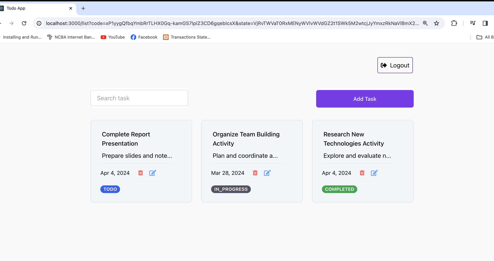

# Task manager

## Run Project Locally Without Docker

The project consists of two parts: Client and Server.

### Client

```bash
cd Client
npm install
npm start
```

To run tests:
```bash
npm test
```

- On your favorite browser, navigate to http://localhost:3000

### Server

```bash
cd Server
npm install
npm start
```
### Endpoints Accessible from http://localhost:8080

#### Create Task

- **Endpoint**: [http://localhost:8080/api/v1/createTask](http://localhost:8080/api/v1/createTask)
- **Description**: Endpoint to create a new task.

#### Get All Tasks

- **Endpoint**: [http://localhost:8080/api/v1/getall](http://localhost:8080/api/v1/getall)
- **Description**: Endpoint to retrieve all tasks.

### Run Project Locally With Docker

From the root of the project run the following commands : 

```bash
docker compose build 
docker compose up
```

### Screenshots





